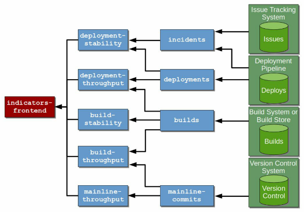

# Dockson, a Continuous Delivery Measurement Service

**Insipired by [Measuring Continuous Delivery: The what, why, and how of measuring Continuous Delivery](https://www.goodreads.com/book/show/35508935-measuring-continuous-delivery)**

* notifications
  ```json
  {
    "timestamp": "<datetime>",
    "source": "", // github, teamcity, etc.
    "type": "commit|build|deploy|incident",
    "name": "", // "my service", "master"
    "version": "", // "1.0.1"
    "status": "success|fail",
    "tags": [], // branch, commit hash, etc.
    "groups": ["serviceOne", "teamTwo"] // things to group metrics by (e.g. serviceName, team, etc)
  }
  ```
* [ ] measurements
  * [ ] deployment stability
    * `d = deployments, f = failures, t = time`
    * [ ] failure rate
      * [ ] percentage of deployments which cause prod error
      * [ ] `dfr = percent( f in t / d in t )`
    * [ ] failure recovery time
      * [ ] time between start and end of production failures
      * [ ] `dfrt.median = median( ( f.end - f.start) for f in t )`
      * [ ] `dfrt.stddev = stddev( ( f.end - f.start) for f in t )`
    * [ ] graphs:
      * [ ] axes: `x = time, y1 = dfr, y2 = dfrt`
      * [ ] lines: `dfr, dfrt.median, dfrt.stddev`
  * [ ] deployment throughput
    * `dn = deploy time, n = build finish time, d = prod deployments, t = time`
    * [ ] lead time
      * [ ] time between creating package and it's deployment
      * [ ] `dlt.median = median( (d^n - b^n ) for d in t )`
      * [ ] `dlt.stddev = stddev( (d^n - b^n ) for d in t )`
    * [x] frequency / interval
      * [x] time between production deployments
      * [x] `di.median = median( (d^n - d^n-1 ) for d in t )`
      * [x] `di.stddev = stddev( (d^n - d^n-1 ) for d in t )`
    * [ ] graphs:
      * [ ] axes: `x = time, y = days`
      * [ ] lines: `dlt.median, dlt.stddev, di.median, di.stddev`
  * [ ] build stability
    * `b = builds, f = failures, t = time`
    * [x] failure rate
      * [x] percent of builds which fail
      * [x] `bfr = percent( f in t / b in t )`
    * [x] failure recovery time
      * [x] time between start and end of failures
      * [x] `bfrt.median = median( ( b^n+1 - b^n ) for f in t )`
      * [x] `bfrt.stddev = stddev( ( b^n+1 - b^n ) for f in t )`
    * [ ] graphs
      * [ ] axes: `x = time, y1 = bfr, y2 = bfrt`
      * [ ] lines: `bfr, bfrt.median, bfrt.stddev`
  * [ ] build throughput
    * `m^n = commit time, b = builds, b^n = build finish time, t = time`
    * [x] build lead time
      * [x] time between master commit and build artifact
      * [x] `blt.median = median( ( b^n- m^n ) for b in t )`
      * [x] `blt.stddev = stddev( ( b^n- m^n ) for b in t )`
    * [x] build interval
      * [x] time between artifact publishes
      * [x] `bi.median = median( (b^n - n^n-1 ) for b in t )`
      * [x] `bi.stddev = stddev( (b^n - n^n-1 ) for b in t )`
    * [ ] graphs
      * [ ] axes: `x = time, y = hours`
      * [ ] lines: `blt.median, blt.stddev, bi.median, bi.stddev`
  * [ ] master throughput
    * `m^n = master commit time, b^n = branch commit time, m = master commits, t = time`
    * [x] master lead time
      * [x] time between commit to branch and merge to master
      * [x] `mlt.median = median( ( m^n - b^n ) for m in t )`
      * [x] `mlt.stddev = stddev( ( m^n - b^n ) for m in t )`
    * [x] master interval
      * [x] time between master commits
      * [x] `mi.median = median( ( m^n - m^n-1) for m in t )`
      * [x] `mi.stddev = stddev( ( m^n - m^n-1) for m in t )`
    * [ ] graphs
      * [ ] axes: `x = time, y = hours`
      * [ ] lines: `mlt.median, mlt.stddev, mi.median, mi.stddev`
* base architecture
  * 
* eventing architecture
  * masterCommit projection:
    * emits `MasterCommitEvent` event when a masterCommit matches with a branchCommit
    * `[ ...commitNotification... ] => MasterCommit(sourceCommit, masterCommit)`
  * masterLeadTime projection
    * populates `MasterLeadTimeView` from `MasterCommitEvent`s
  * masterInterval projection
    * populates `MasterIntervalView` with intervals between `MasterCommitEvent`s
